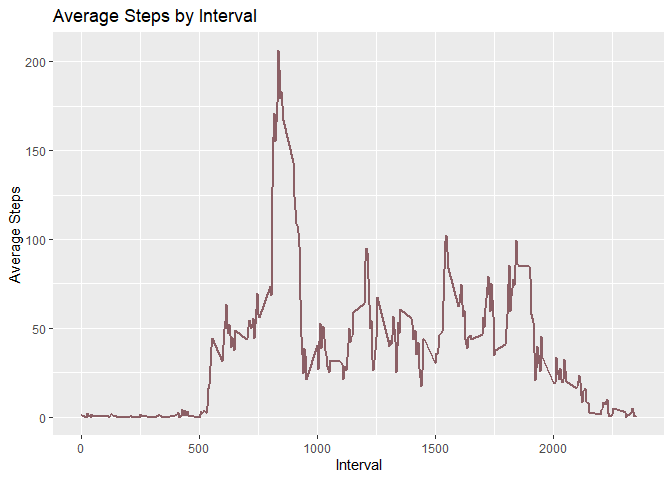
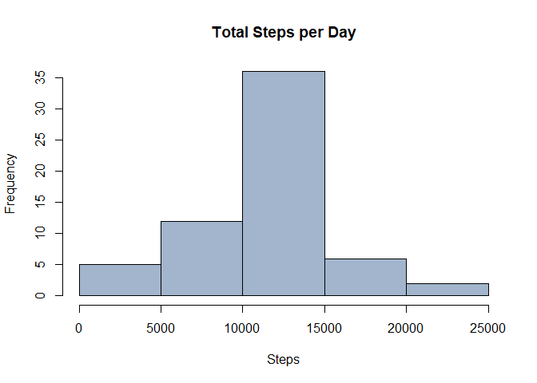
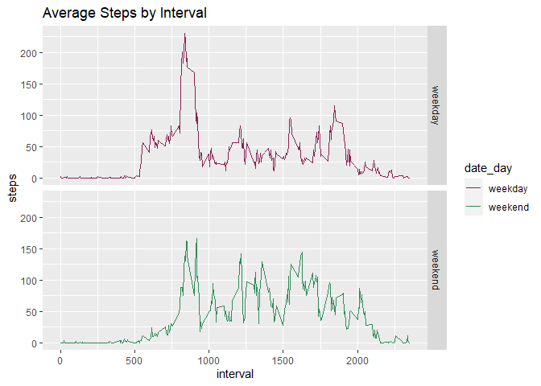

## Introduction 
It is now possible to collect a large amount of data about personal movement using activity monitoring devices such as a Fitbit, Nike Fuelband, or Jawbone Up. These type of devices are part of the “quantified self” movement – a group of enthusiasts who take measurements about themselves regularly to improve their health, to find patterns in their behavior, or because they are tech geeks. But these data remain under-utilized both because the raw data are hard to obtain and there is a lack of statistical methods and software for processing and interpreting the data.

This assignment makes use of data from a personal activity monitoring device. This device collects data at 5 minute intervals through out the day. The data consists of two months of data from an anonymous individual collected during the months of October and November, 2012 and include the number of steps taken in 5 minute intervals each day.
The data for this assignment can be downloaded from the course web site:

Dataset: Activity monitoring data [52K]

The variables included in this dataset are:

steps: Number of steps taking in a 5-minute interval (missing values are coded as \color{red}{\verb|NA|}NA)

date: The date on which the measurement was taken in YYYY-MM-DD format

interval: Identifier for the 5-minute interval in which measurement was taken

The dataset is stored in a comma-separated-value (CSV) file and there are a total of 17,568 observations in this dataset.

## Assignment
This assignment will be described in multiple parts. You will need to write a report that answers the questions detailed below. Ultimately, you will need to complete the entire assignment in a single R markdown document that can be processed by knitr and be transformed into an HTML file.

Throughout your report make sure you always include the code that you used to generate the output you present. When writing code chunks in the R markdown document, always use \color{red}{\verb|echo = TRUE|}echo = TRUE so that someone else will be able to read the code. This assignment will be evaluated via peer assessment so it is essential that your peer evaluators be able to review the code for your analysis.

For the plotting aspects of this assignment, feel free to use any plotting system in R (i.e., base, lattice, ggplot2)

Fork/clone the GitHub repository created for this assignment. You will submit this assignment by pushing your completed files into your forked repository on GitHub. The assignment submission will consist of the URL to your GitHub repository and the SHA-1 commit ID for your repository state.

NOTE: The GitHub repository also contains the dataset for the assignment so you do not have to download the data separately.

## Part 1: Loading and preprocessing the data
Import downloaded dataset, first row treated as row names

```r
library(ggplot2)
```

```
## Warning: package 'ggplot2' was built under R version 4.2.2
```

```r
library(dplyr)
```

```
## Warning: package 'dplyr' was built under R version 4.2.2
```

```
## 
## Attaching package: 'dplyr'
```

```
## The following objects are masked from 'package:stats':
## 
##     filter, lag
```

```
## The following objects are masked from 'package:base':
## 
##     intersect, setdiff, setequal, union
```

```r
all_fit_data <- read.csv("activity.csv", header = TRUE)
```

## Part 2: Calculate the mean total number of steps taken per day
Step 1: calculate the total number of steps taken per day, ignoring missing values

```r
step_by_date<- with(all_fit_data, aggregate(steps ~ date, FUN = sum, na.rm = TRUE))
```

Step 2: Make a histogram of the total number of steps taken each day

```r
hist(step_by_date$steps, col = "cadetblue3", xlab = "Steps", main = "Total Steps per Day")
```

<!-- -->

Step 3: Calculate and report the mean and median of the total number of steps taken per day

```r
mean_steps <- mean(step_by_date$steps, na.rm = TRUE)

mean_steps
```

```
## [1] 10766.19
```

```r
med_steps <- median(step_by_date$steps, na.rm = TRUE)

med_steps
```

```
## [1] 10765
```

## Part 3: Determine the average daily activity pattern 
Step 1: Make a time series plot of the five minute interval and the average number of steps taken, averaged across all days 

```r
#average data by interval 
step_by_int <- with(all_fit_data, aggregate(steps ~ interval, FUN = "mean"))

#give new name to steps column
colnames(step_by_int)[2] = "step_avg"

plot_step_int <- ggplot(step_by_int, aes(interval, step_avg))

plot_step_int + geom_line(stat = "identity", color = "lightpink4", linewidth = 1) + labs(title = "Average Steps by Interval") + labs(x = "Interval", y = "Average Steps")
```

<!-- -->

Step 2: Determine which 5 minute interval contains the maximum number of steps

```r
#print the row with the maximum value using which.max
step_by_int[which.max(step_by_int$step_avg),]
```

```
##     interval step_avg
## 104      835 206.1698
```

## Part 4: Imputing Missing Values 
Step 1: Calculate and report the total number of missing values in the dataset 

```r
total_na <- sum(is.na(all_fit_data))
total_na
```

```
## [1] 2304
```

Step 2: 
*Come up with a strategy to fill in the missing values 
*Create a new dataset that is the same as the first dataset but with the missing values filled in

```r
#I chose to fill in missing values using the average for the interval associated with the missing value 

#create new data frame with additional column containing averages by interval 
new_fit_data <- all_fit_data %>% left_join(step_by_int, by = "interval")

#replace NA values with the average for that interval and remove the new column with averages
new_fit_data_2 <- new_fit_data %>% mutate(steps = ifelse(is.na(steps), `step_avg`, steps)) %>% select(-step_avg)
```

Step 3: Make a histogram of the total number of steps taken each day

```r
step_by_date_filled<- with(new_fit_data_2, aggregate(steps ~ date, FUN = sum))

hist(step_by_date_filled$steps, col = "lightsteelblue3", xlab = "Steps", main = "Total Steps per Day")
```

<!-- -->

Step 4: 
*Report the mean and median total number of steps taken per day
*Report whether these values differ from the estimates from the first part of the assignment, and if so what the impact is 

```r
mean_steps_2 <- mean(step_by_date_filled$steps)

mean_steps_2
```

```
## [1] 10766.19
```

```r
med_steps_2 <- median(step_by_date_filled$steps)

med_steps_2
```

```
## [1] 10766.19
```
When the NA values were present, I calculated the mean to be 10766.19 and the median to be 10765. 
After filling in the NA values using the interval average, I calculated the mean to be 10766.19 and the median to be 10766.19. The median changed after filling in the missing values but the mean did not. 

## Part 5: Determine if there are differences in activity patterns between weekdays and weekends
Step 1: Create a new factor variable in the dataset with two levels ("weekday" and "weekend")

```r
#Add a new column  to new_fit_data_2 containing the date in right format (date_format)
new_fit_data_2$date_format = as.Date(new_fit_data_2$date) 

#Create a new data frame with the date_format column added as the day of the week - this added column not replace
new_fit_data_2$date_day = weekdays(new_fit_data_2$date_format) 

#Use ifelse to create a column that returns weekday or week based on what is in date_day column 
new_fit_data_2$date_day = ifelse(new_fit_data_2$date_day %in% c("Saturday", "Sunday"), "weekend", "weekday")

#remove unnecessary date_format column
with_week <- new_fit_data_2 %>% select(-date_format)
```

Step 2: Make a panel plot containing a time series plot of the 5 minute interval and the average number of steps taken, averaged across all weekdays or weekends. 

```r
#for the WEEKDAY PLOT aggregate data by interval 
weekday_plot <- with(with_week, aggregate(steps ~ interval + date_day, FUN = "mean"))

#Put the two plots together using faceting in ggplot2

weekend_weekday <- ggplot(weekday_plot, aes(interval, steps, color = date_day))

weekend_weekday + geom_line(stat = "identity") + labs(title = "Average Steps by Interval") + facet_grid(rows = vars(date_day)) +scale_colour_manual(values = c("violetred4", "seagreen4"))
```

<!-- -->


